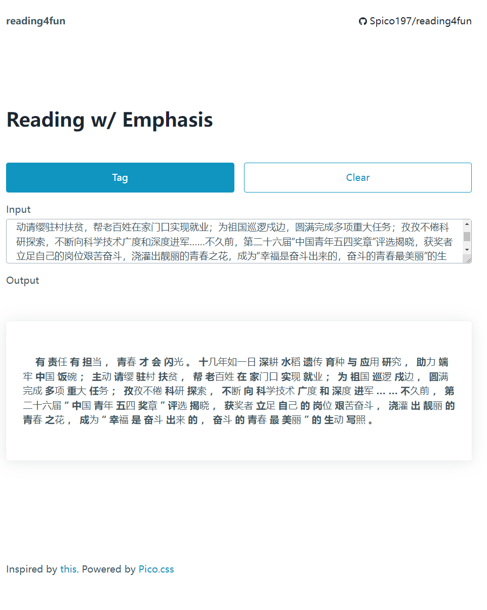

# reading4fun

Interesting reading style with first Chinese char emphasised.

Inspired by [bionic-reading](https://bionic-reading.com/).



## 🌴 Requirements

Python3

```bash
$ pip install jieba fastapi pydantic uvicorn
```

## 🚀 QuickStart

```bash
$ bash run.sh
```
